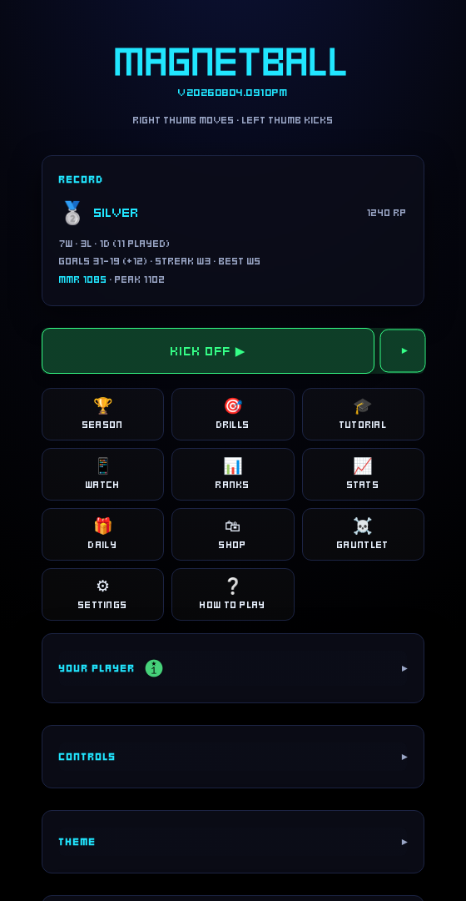
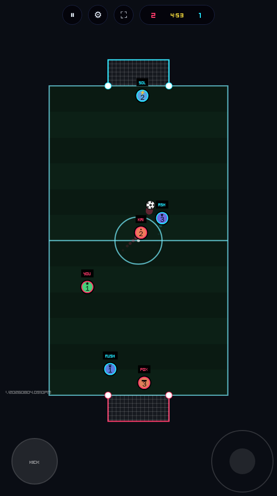
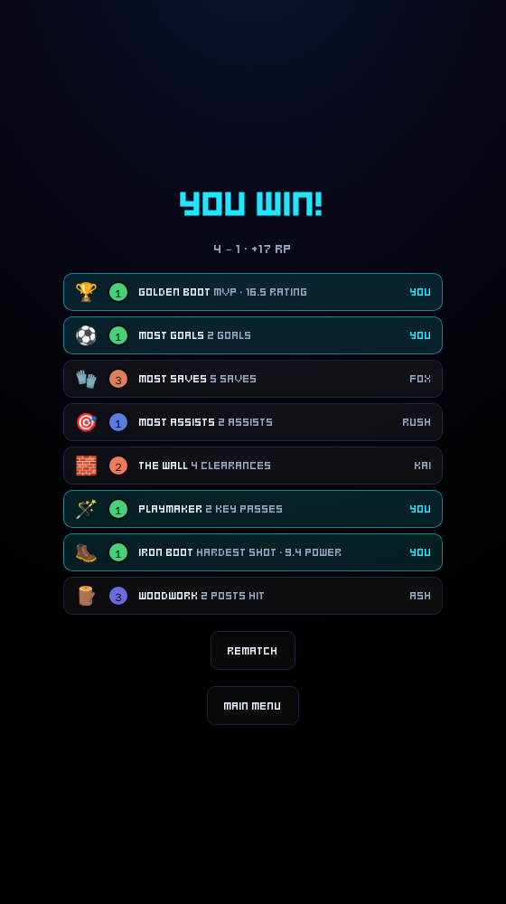
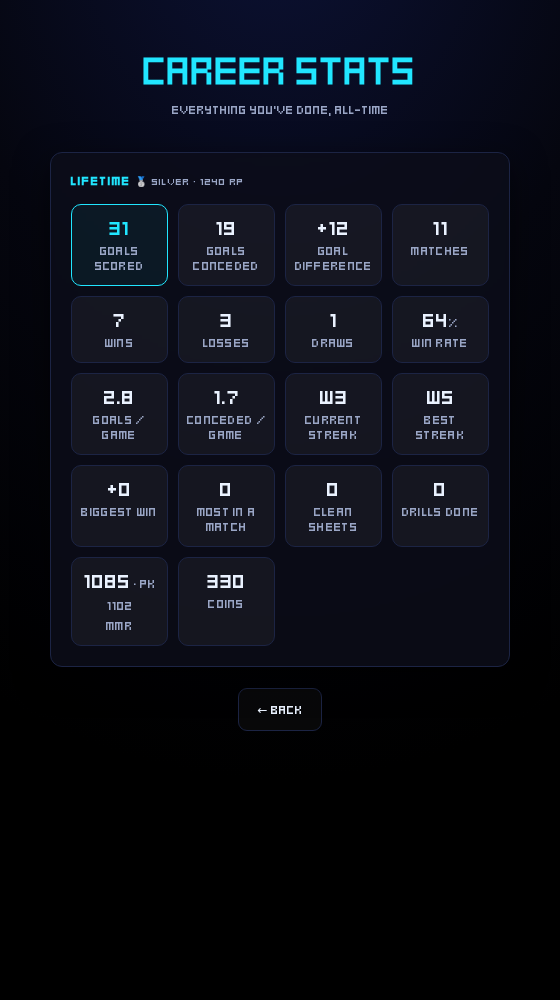

# Magnetball — UI Terminology

A shared vocabulary for describing changes. Point at anything below by name and it's
unambiguous. Screenshots use the default **Neon** theme; labels are the exact on-screen text.

> **Two contexts:** the **Menu** (everything before/after a match — screens, cards, settings)
> and the **Match / Pitch** (the live game with the ball and players).

---

## The main menu

### Cards (the stacked panels / "sections")
Each panel is a **card**, named by its heading. A line inside a card is a **row**.

| Card | Rows inside |
|------|-------------|
| **Record** | rank, RP, W/L/D, goals, streak, MMR |
| **Match** | Mode · Field · Difficulty · Match length · Input · Ball · Pitch surface · Grass cut · Kickoff rule · Player names · Party modifiers — its **heading is the Kick Off button**; the chevron beside it opens the card |
| **Your Player** | Name · Colour · Cap · Countryball · Animal · **Text** · Eyes |
| **Controls** | Handed · Stick sensitivity · Who plays · Colour-blind markers · Controller |
| **Theme** | Visual style |
| **Display** | Layout · Pitch direction · Settings location · Screen |
| **Ball** | Look *(nine drawn patterns; cosmetic only — ball physics is Match → Ball)* |
| **Sound** | Master · Volume · Whistle · Crowd · Pass / kick · Wall bounce · Net |
| **Game Feel** | Preset, then three groups — **⚽ Ball controls** (Ball control · Kick power · Max ball speed · Ball glide · Ball magnet · Trap window), **🕹️ Player controls** (One-handed · Player acceleration · Player float · Stick sensitivity), **🎬 Presentation** (Screen shake & effects · Auto-replay goals · Match speed · Debug readout) |
| **Online** | Room code *(coming-soon stub)* |

*Example: "the **Match speed** row in the **Game Feel** card" or "the **Field** row in the **Match** card."*

### Nav tiles (the button grid)
The 3-wide grid of buttons — each is a **nav tile**:
**Season · Drills · Tutorial · Watch · Ranks · Stats · Daily · Shop · Gauntlet · Settings · How to play.**
Above them is **Kick Off** — the big green button, which doubles as the **Match** card's heading.

Some tiles open a screen with a **different name** — worth knowing:

| Nav tile | Opens |
|----------|-------|
| **Ranks** | the **Leaderboard** screen |
| **Watch** | the **social feed** (clip feed) |
| **Season** | the **Cup Run** screen |
| **Gauntlet** | the roguelike run |
| **Stats** | the **Career Stats** screen |

---

## On the pitch (in-match)

- **Disc** / **player** — a round player. **Ball** — the ball.
- Parts of a disc: **team ring** (red/blue outer ring — this is what tells teams apart),
  **core** (your chosen colour), **faceplate** (the flag/animal), **eyes**, **cap**,
  and the **name label** floating above.
- **Goal / goal mouth** (the opening) · **net** · **posts** (the two dots at the mouth).
- **Pitch** (the whole field) · **court** (the striped inner area) · **walls** · **arcs** (rounded corners).
- Touch controls: **move pad** (thumbstick) · **kick pad** · **kick ring** (charge indicator).
- **HUD** — the top bar. **Scorebug** — the score chip. **Clock** — the timer.
  **Banner** — the big mid-screen text (e.g. "GOAL!").
- "Juice" (feel effects): **screen shake · hit-stop** (tiny freeze) **· flash · slow-mo · confetti · ball trail**.

---

## Result screen (match end)

Also called the **match-end overlay**. Contains the **title** ("YOU WIN!" / "YOU LOSE"),
the **scoreline**, any **award rows** (MVP, Golden Boot, etc.), and the **Rematch** / **Main Menu**
buttons.

---

## Career Stats screen

Opened from the **Stats** nav tile. A grid of **stat tiles**, each a **value** over a **label**
(e.g. *Goals scored*, *Win rate*, *Clean sheets*).

---

## Modes & match types
- **Team sizes:** 1v1 · 2v2 · 3v3 · 4v4 · **Duo** (steer 2) · **2-Player** (same phone) ·
  **Killer Lobsters** · **Training**.
- **Party modifiers:** Big ball · Low-gravity · Sudden death · **Multi-ball**.
- **Game modes:** **Cup Run** (Season) · **Gauntlet** · **Drills** · **Tutorial**.

## Customization & progression
- **Cosmetics:** Cap · Countryball (flag) · Animal · Text · Eyes · Colour · Ball look.
- **Progression:** **RP** (rank points) → **Rank** (Wood → Legend) · **MMR** (hidden Elo) ·
  **Streak** · **Coins** (shop currency) · **Unlocks**.

## Themes (by name)
**GameMan · Neon · Flat · Grass · Mono · VideoSoccer · Paper** *(Paper = the light one)*.

---

## Tips for describing a change
- Name the **screen/card** first, then the **row/element**: *"On the **Career Stats** screen, add a **tile** for…"*
- On the pitch, say the **part**: *"the **team ring**", "the **kick pad**", "the **banner**"*.
- If a tile's label differs from where it goes, use the label: *"the **Ranks** tile (Leaderboard)"*.
- Not sure what something's called? Describe where it is ("top-left of the pitch") — this doc will grow.

*Screenshots in `docs/img/` are current as of v20260804.1005PM (Neon theme). Re-capture them
with `docs/img/` in mind if the UI changes noticeably.*
