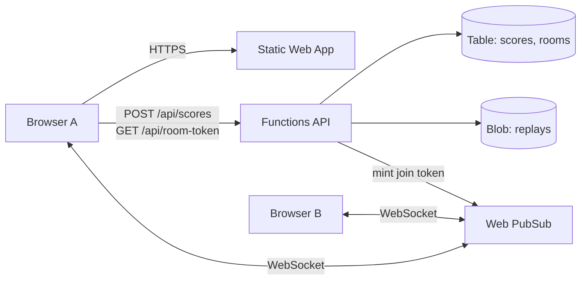

# What `infrastructure/main.bicep` creates, and what it costs

One Bicep file creates every Azure resource online mode needs, into one resource group
(`magnetball-rg`). Bicep is Azure's own infrastructure language: declarative, checked by the
compiler before anything is created, and idempotent, so re-deploying with nothing changed
changes nothing.

| Piece | What it does for Magnetball | Azure service | Why this one |
| --- | --- | --- | --- |
| Game hosting | Serves `index.html`, `sw.js`, `assets/`, the `/menu` and `/vj` stubs | Static Web App (Free) | Static files at the root, HTTPS and a custom domain for free |
| Real-time relay | Room codes, joining a friend's match, inputs and snapshots between two browsers | Web PubSub (Free_F1) | Plain browser `WebSocket`, no client library, so the game stays dependency-free |
| API | Leaderboard read and write, replay upload and list, minting the token a browser needs to join a room | Functions, Consumption plan, Node.js 20 | Same language as the game, pay per call, free grant covers a hobby game |
| Data | Scores and rooms as rows, replay files as ~25 KB JSON blobs | Storage: Table + Blob | Cheapest store on Azure, no database server to run |

The browsers never talk to each other directly. Each opens a WebSocket to Web PubSub after
asking the API for a token, and the service forwards messages inside a room group. The API
is the only thing holding storage keys.

## Decisions in the file

- **`uniqueString` makes the storage name deterministic.** Storage names are global across
  all of Azure, so a plain `magnetball` is taken; the hash of your resource group makes it
  yours and the same on every deploy.
- **The Function App's CORS list is the Static Web App's own hostname**, read off the `site`
  resource, so Bicep orders the two for you and a browser on your site is the only origin
  the API answers. Add `http://localhost:8080` there while developing.
- **Two keys are wired, and neither is written anywhere you can read it.** `listKeys()` runs
  at deploy time inside Azure and lands the connection strings in the Function App's
  settings only. The outputs are hostnames and names, and nothing else.
- **The Static Web App pins `eastus2`** because the Free tier is offered in few regions;
  everything else follows the resource group's region.
- **`skipGithubActionWorkflowGeneration: true`** stops Azure writing its own workflow into
  the repo. `.github/workflows/azure.yml` is ours.

## Costs and limits

As written everything is on a free or free-grant tier and a hobby game costs under a dollar
a month, nearly all of it storage. The figures are approximate list prices; check the Azure
pricing pages before relying on them.

| Service | Tier in the Bicep | Free allowance | First thing that runs out | Next step up |
| --- | --- | --- | --- | --- |
| Static Web Apps | Free | 100 GB bandwidth a month, 2 custom domains | Bandwidth, only with thousands of players | Standard, about 9 USD a month |
| Web PubSub | Free_F1 | 20 concurrent connections, 20,000 messages a day | Messages: 20 snapshots a second is 16 minutes of play a day | Standard_S1, about 1.6 USD a day per unit, 1,000 connections and 1 million messages a day |
| Functions | Consumption (Y1) | 1 million calls and 400,000 GB-seconds a month | Never, for a leaderboard | Nothing needed |
| Storage | Standard_LRS | None, but pennies: about 0.02 USD per GB a month | A replay library: 1,000 whole matches is roughly 800 MB | Blob lifecycle rule to delete replays older than 90 days |
| Application Insights | Pay as you go | 5 GB of logs a month | Never at this scale | Nothing needed |

Three things to set up in the first week:

1. **A budget alert.** Cost Management in the portal, 5 USD a month with an email at 80%.
   It costs nothing and is the only way a runaway loop announces itself.
2. **Watch the Web PubSub message count.** Every snapshot the host sends is one message per
   recipient, so a 4-player room at 20 Hz is 60 messages a second. Before paying: send
   snapshots at 10 Hz, and send only inputs between snapshots.
3. **Key rotation** is a portal regenerate plus a workflow re-run; see `SETUP.md`.

Two limits that are not money: the Free Static Web App has no staging environments and a
250 MB app size cap, and the Consumption Functions plan cold-starts after idle, so the first
leaderboard call in a while can take two to three seconds. The game already shows its
offline sample board while it waits.
